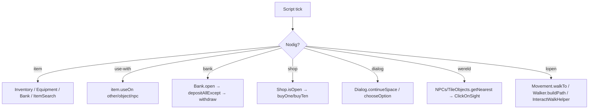

# LoneBot API-blauwdruk (Storm-first)

**Bron:** [Storm Javadocs](https://stormjavadocs.z6.web.core.windows.net/index.html)  
**Doel:** scripts gebruiken `net.storm.sdk.*` zoals Storm — geen per-script bank/shop/dialog/world loops.

**Laatst bijgewerkt:** 2026-08-29 · LoneBot `0.3.300`

Status: `ok` | `partial` | `later`

---

## Keuzes (vast)

- **Storm is de blauwdruk** — methodenamen volgen `net.storm.sdk.*` / `net.storm.api.*`.
- **Geen stubs die `true`/`false` liegen.**
- **Invoke + mouse fallback** waar vanilla RL geen Storm-inject heeft.
- **Scripts roepen SDK aan** — geen eigen Shop/Trade/Dialog/Bank-loops.
- **Client-thread timeout ≠ leeg.** `callOnClientThread` (max 1,5s) valt terug op `null`/`""`/lege lijst. Dat is geen bewijs dat inv/NPC/object ontbreekt. Dump 1×, cache id+naam, match op **item-id**, hergebruik laatste snapshot als slots bezet zijn. Geen `getName()` per entiteit vanaf de loop-thread.

**Buiten scope (niet nodig voor F2P scripts):** sailing, POH-pathfinder models, Storm client-UI/plugin-config internals, events-bus, loadout-fetch volledige port.

---

## Script-oppervlak (Storm SDK)

### Items

| Storm | LoneBot | Status |
|-------|---------|--------|
| `Inventory` find/count/full/containsAll | `sdk.items.Inventory` | ok — 0.3.188: naam-cache + last-good snapshot; timeout ≠ leeg |
| `IItem` / `IInventoryItem` | `api.domain.items` | ok |
| `useOn(item/object/npc/widget/ground)` | `RlInventoryItem` + `MenuInteract` | ok |
| `Equipment` + `fromSlot` + containsAll | `Equipment` / `EquipmentSlot` | ok |
| `Bank` open/withdraw/deposit/except/noted | `Bank` + `Bank.Inventory` + `setNoted` | ok |
| `BankLocation` | F2P + GE/Edge/Falador/Al Kharid | ok |
| `BankEquipment` | worn panel while bank open | ok |
| `DepositBox` inventory/worn/qty | `DepositBox` | ok — 0.3.204: `isQuantityAllSelected()` (varbit 6590 + widget) |
| `Shop` isOpen/stock/buy/sell | `Shop` (iface 300/301) | ok |
| `Trade` screens/offer/accept | `Trade` (335/334) | ok |
| `GrandExchange` | `GrandExchange` + `GeHelper` | ok |
| `ItemSearch` | inv → equip → bank | ok |
| `ItemInfos.lookup` / `ItemInfo` | gewicht, slot, bonuses, attack speed | ok |

### Entities

| Storm | LoneBot | Status |
|-------|---------|--------|
| `NPCs` getAll/nearest/query/hintArrow | `NPCs` + `ActorQuery.alive/nearest` | ok |
| `IActor` / `INPC` / `IPlayer` | attack, interacting, transform, overhead, player interact | ok |
| `Players` getLocal/getAll/nearest | `Players` | ok |
| `TileObjects` getAll/nearest(from) | `TileObjects` | ok |
| `TileItems` Take | `TileItems` | ok |
| `Tiles` getAt/getOccupied | `Tiles` | ok |

### Widgets / UI

| Storm | LoneBot | Status |
|-------|---------|--------|
| `IWidgets` / `Widgets.get/getAll/getChildren/closeInterfaces` | `sdk.widgets.Widgets` implements `api.widgets.IWidgets` | ok |
| `IWidget.interact` | `RlWidget` CC_OP + mouse | ok |
| `IDialog` / `Dialog` continue/options/input | `Dialog` (mouse + 1–9 keys); `forceOpen` no-op (geen NPC-hook) | ok |
| `ITabs` / `Tab.CLAN_CHAT` / `LOG_OUT` | `Tabs` | ok |
| `IProduction` / `ProductionQuantity` | `Production` + skillmulti 1/5/10/X/All widgets | ok |
| `IFriends` getAll/isAdded/isOnline | `Friends` via `FriendContainer` | ok |
| `IPrayers` points/best-offensive/quick | `sdk.prayer.Prayer` + `sdk.widgets.Prayer` | ok |
| `IMinigames` / `MinigameTeleport` | grouping iface 76 + varp 888 cooldown | ok |
| `IBankWornItems` / `BankWornItem` | bank worn panel widgets | ok |
| `InterfaceAddress` / `WidgetGroup` | deprecated; packed ids via WidgetInfo/InterfaceID | ok |

### Game / movement / magic

| Storm | LoneBot | Status |
|-------|---------|--------|
| `Game` login/logout/wildy | `Game` | ok |
| `Combat` hp/spec/poison/attackable | `game.Combat` | ok |
| `Skills` / `Vars` | ok | ok |
| `Chat` / `Camera` | ok | ok |
| `Worlds` + hop | `Worlds` + `WorldHopper` | ok |
| `WorldMap` / `House` | open/close + inside heuristic | partial |
| `Movement` walk/run/destination/getPath | `Movement` + `WalkClickHelper` | ok — 0.3.300: Storm `walkTo`/`getPath`/`calculateDistance` overloads + `IMovement` via `Static.getMovement()` |
| `Walker` / `IWalker` buildPath/walkAlong | `Walker` | ok — 0.3.300: `WalkOptions`, transports, teleports, wilderness-avoid, cache |
| `WalkOptions` | `api.movement.WalkOptions` | ok |
| `TilePath` walk/remaining/teleports | `TilePath` | ok — 0.3.300: `walk(WalkOptions)`, `addTeleport`/`addTransport` |
| `Reachable` | collision/walls/doors/flood-fill + isInteractable | ok |
| `ClickOnSight` | scene + pad vrij + ≤40t → interact/invoke (ook off-screen); anders deur / walk | ok |
| `ChargeManager` / `TeleportLoader` / `TransportLoader` | jewelry-charges, custom teleports, object/NPC/dialog transports | ok |
| `LocalCollisionMap` / `Teleport` / `Transport` | live scene + pathfinder models | ok |
| `Magic` cast/autocast | `Magic` | ok |
| `Keyboard` type/enter | `Keyboard` | ok |
| `Quests` state by enum/name | `Quests` | ok |

---

## Flow — typische script-stap



### ClickOnSight (0.3.205)

Klikken/invoken zodra het doel **in de scene** staat, **≤ 40 tegels** (Chebyshev) én `Reachable.isInteractable`. **Niet** eerst ernaartoe lopen of camera draaien. Off-screen = menu-invoke; on-screen = hull/clickbox.

| Check | Nee → |
|-------|--------|
| In scene, pad vrij, afstand ≤ 40 | `CLICKED` — on-screen click of off-screen invoke; client loopt zelf |
| Pad geblokt (dichte deur/muur) | `BLOCKED` — Open op de deur, anders walk naar obstakel |
| Verder dan 40 tegels of niet in scene | `WALK` richting doel (niet ernaast gaan staan) |

Scripts: `ClickOnSight.interactOrApproach(npc|object, approachTile, "Pay-fare", …)`.

### FarWalk.keepSkillTicking (0.3.616 / 0.3.618)

Default: tijdens lange pad-walks (`farWalk`, doel &gt;~12 tegels) pauzeert `LoopHost` skill-scripts zodat de walker vrij doorlinkt.

Opt-in voor mid-approach COS (WC→boom, later Imp/Fish spot):

```java
FarWalk.keepSkillTicking(true);  // skill tickt tijdens farWalk
Movement.walkTo(workArea);
// na succesvolle ClickOnSight: clearPath / stop approach

FarWalk.keepSkillTicking(false); // bank-reis: alleen walker
```

Flag is sticky tot `false` / `FarWalk.clear()`. `FarWalk.allowsPlugin` laat alleen de **actieve** skill door — **park-Star nooit** (anders blokkeert hopper/watch het doorlinken van WC/Fish).

---

## Afgerond 0.3.300

Storm [path API](https://stormjavadocs.z6.web.core.windows.net/search.html?q=path): `IMovement` / `Movement.getPath`/`walkTo` overloads, `IWalker` / `Walker.buildPath`/`walkAlong`/`buildTransportLinks`/`buildTeleportLinks`, `WalkOptions`, `TilePath.walk(WalkOptions)` + teleports/transports. Scripts: `Movement.walkTo(point)` blijft de gewone collision-walk; `Static.getWalker()` voor pad-opbouw.

## Afgerond 0.3.165

Storm [`domain.actors`](https://stormjavadocs.z6.web.core.windows.net/net/storm/api/domain/actors/package-summary.html): `IActor.attack/getInteracting/getTarget/getSpotAnimationCount`, `INPC.getOverheadIcons/transform/update`, `IPlayer` friend/clan/skull + echte `interact` via player-options (was een `false`-stub).

## Afgerond 0.3.164

Storm [`net.storm.sdk.items.info`](https://stormjavadocs.z6.web.core.windows.net/net/storm/sdk/items/info/package-summary.html): `ItemInfos.lookup(id)` + `ItemInfo` (weight, equipmentType, bonuses, weapon speed) uit bundled item-stats dump. Noted/placeholder → basis-item. Animatie-IDs/attack-distance zitten niet in die dump → 0, niet verzonnen.

## Afgerond 0.3.163

Storm [`Reachable`](https://stormjavadocs.z6.web.core.windows.net/net/storm/sdk/movement/Reachable.html): `getCollisionFlag` / `isObstacle` / `isWalled` / `hasDoor` / `isDoored` / `canWalk` / `getNeighbour` / `getVisitedTiles` / `isInteractable` (flood-fill tot naastliggende tegel). `ITile` wrap via `Tiles.get`.

## Afgerond 0.3.162

Storm [`net.storm.sdk.movement.pathfinder`](https://stormjavadocs.z6.web.core.windows.net/net/storm/sdk/movement/pathfinder/package-summary.html): `ChargeManager` (inv/equip charge-parse + unlock via quest/item), `TeleportLoader`, `TransportLoader` factories met echte interact (`TileObjects`/`NPCs`/`Dialog`/`useOn`). Models: `Teleport`, `Transport`, `Requirements`, `LocalCollisionMap`.

## Afgerond 0.3.161

Volledige Storm **script-laag** (geen deeltjes meer): Shop, Trade, DepositBox Storm-methods, Dialog mouse+options-as-widgets, IItem + useOn NPC/widget/ground, NPCs hint-arrow + nearest-from, Players getAll, Tiles, BankLocation, Bank.Inventory / noted / depositEquipment, BankEquipment, Worlds hop, Prayer flush/setEnabled, Combat spec-orb, Friends isFriend, Minigames/House/WorldMap, Production.Quantity, Keyboard.type(..., enter).

Zie `sdk/src/main/resources/lonebot-api-catalog.json` voor package-status.
