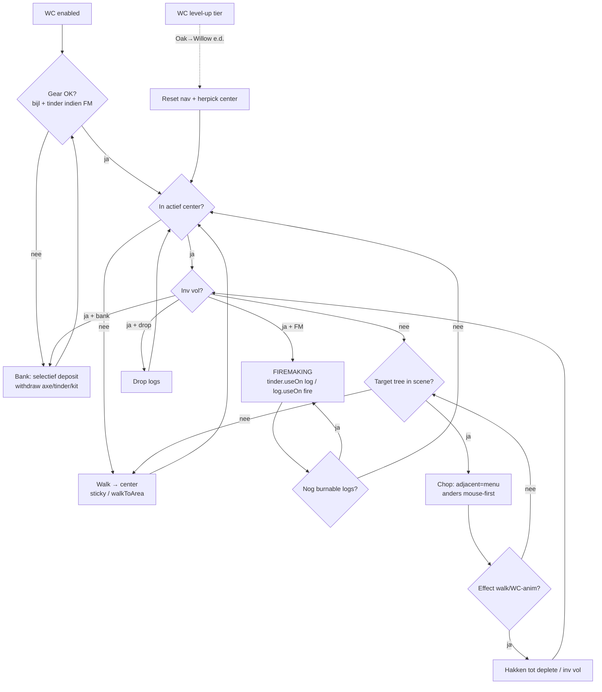

# WC + API basis (bouwstenen eerst)

**Doel:** eerst een **betrouwbare LoneBot SDK/API** (procedures die overal herbruikbaar zijn), daarna WC erop laten draaien — niet per script opnieuw inventeren.

**Laatst bijgewerkt:** 2026-08-17 · LoneBot `0.3.188` / WC `0.1.38`

> **API-primitives eerst:** zie [`docs/API-BLAUWDRUK.md`](./API-BLAUWDRUK.md) (Storm Javadoc-parity). Dit bestand = WC erbovenop.

Status: `open` | `in_progress` | `done` | `blocked` | `later`

---

## Keuzes (vast)

- **Prioriteit:** API-bouwstenen → WC-loop stabiel → pas daarna nice-to-haves (forestry polish, GE axe, …).
- **Referentie:** CombatBot `WoodcutterHandler` + Storm helpers — gedrag overnemen, implementatie via LoneBot SDK.
- **Geen thin shell:** stubs die “true” teruggeven zonder effect = verboden (zie `lonebot-full-port.mdc`).
- **WC modus (default nu):** `firemaking=true`, `drop=false`, centers `:fm` / `:drop` / `:bank`.
- **AUTO trees:** Tree → Oak (15) → Willow (30) → … via `WcTrees.bestTreeForLevel` + center herpick.
- **Wel:** gear-prep (bijl + tinder + kit), selectief banken, `useOn` item↔item én item↔object, chop/FM state machine.
- **Niet (tot basis groen):** full UBM-port, multi-skill rotatie, tile-marker excludes, clue-nest bank-withdraw polish.
- **GE bijl-restock:** **blocked** — wacht op user-ja (supply-chain).

---

## Huidige basis

### WC script (`script-woodcutter`)

| Onderdeel | Bestand | Status |
|-----------|---------|--------|
| Loop / states | `WoodcutterLoop.java` | in_progress — chop/FM/walk werkt deels |
| Bonfire / FM | `BonfireHandler.java` + `BonfireQtyHelper.java` | in_progress — chop→fm delay weg; tinder→log 2 ticks |
| Centers / AUTO | `WcCenters.java` | done (oaks/willows/yews defaults) |
| Tree reach | `WcReach.java` | done (cardinaal walk-steps) |
| Axes | `WcAxes.java` | done (level checks) |
| Forestry kit/events | `ForestryKitHandler` / `ForestryEventHandler` | later (na basis) |
| Banking in WC | `WoodcutterLoop#tickBanking` | in_progress — selectief storten; routes nog dun |

### CombatBot referentie (niet opnieuw schrijven — lezen + porten)

- `WoodcutterHandler.java` — chop / FM / bank / GE / walk
- `BonfireQtyHelper.java`
- `ObjectReachHelper` / `InteractWalkHelper`
- `UniversalBankingManager` + `BankHelper` (Lumbridge trap, Draynor)

### LoneBot helpers hergebruiken (SDK)

| Bouwsteen | Class | Nu | Nodig voor basis |
|-----------|-------|----|------------------|
| Bank open/walk | `BankHelper` | deels | Draynor + Lumbridge stairs parity |
| Bank UI | `Bank` + `BankWithdrawHelper` | deels | depositExcept / session-patroon |
| GE | `GrandExchange`, `GeHelper`, `GeRestockHelper` | aanwezig | pas na user-ja voor WC axe |
| Inventory use | `IInventoryItem.useOn(item/object)` | **done** (0.3.157) | in-game valideren |
| Tile interact | `TileObjectInteractHelper`, `MenuInteract` | deels | vals-OK voorkomen + effect-verify |
| Movement | `MovementHelper`, `WalkClickHelper`, `TilePathWalker` | deels | `walkToArea` / sticky reclick |
| Magic | `Magic`, `AutocastCombatHelper` | Imp-pad | WC heeft niet nodig; wel API-kwaliteit |
| Prayer | `Prayer` | deels / stubs | toggle betrouwbaar maken |
| Production / qty | `Production`, `BonfireQtyHelper` | deels | chooseOption valideren |
| Ground loot | `GroundLootPickupHelper` | aanwezig | nests / foreign later |
| AntiBan | `AntiBan` | aanwezig | houden |

---

## Flow — WC basis (zoals Imp-port)

---

## Todo — API bouwstenen (eerst)

| ID | Status | Item | Waar | Prio |
|----|--------|------|------|------|
| API-01 | done | `useOn(IInventoryItem)` — tinder→logs | `RlInventoryItem` | — |
| API-02 | done | `useOn(ITileObject)` — log→fire | `RlInventoryItem` + `MenuInteract` | — |
| API-03 | in_progress | Bank: geen `depositAll` in scripts; deposit-by-name / except-keep | `Bank` + callers | hoog |
| API-04 | done | Bank-open parity: Draynor + Lumbridge stairs | `BankHelper.tryOpenFullBank` | hoog |
| API-05 | done | Bank-session helper | `BankSession` | hoog |
| API-06 | done | Tile interact: effect-verify helper | `InteractWalkHelper` | hoog |
| API-07 | open | `MovementHelper.walkToArea(center, radius)` betrouwbaar | `MovementHelper` | mid |
| API-08 | open | Prayer toggle zonder stub-fails | `Prayer` | mid |
| API-09 | open | Magic autocast pad stabiel (Imp al; documenteer als standaard) | `Magic` | mid |
| API-10 | open | Ground-item Take betrouwbaar (nests/loot) | `GroundLoot` / MenuInteract | mid |
| API-11 | open | Production.chooseOption in-game valideren | `Production` | mid |
| API-12 | later | GE buy/collect parity + Escalation als script het vraagt | `GeRestockHelper` | later |

**Regel:** scripts mogen alleen **aanroepen** — geen eigen bank/GE/useOn loops kopiëren.

---

## Todo — WC op die basis

| ID | Status | Item | Waar | Prio |
|----|--------|------|------|------|
| WC-01 | in_progress | Chop betrouwbaar (juiste boom, geen lange “geen effect”-loops) | `WoodcutterLoop` | hoog |
| WC-02 | in_progress | FM: licht vuur + bonfire logs tot inv leeg | `BonfireHandler` | hoog |
| WC-03 | done | AUTO tree switch + center herpick bij level-up | `WcCenters` / loop | — |
| WC-04 | open | Gear-prep + bank trip via API-05 (geen ad-hoc tickBanking) | loop | hoog |
| WC-05 | open | Axe-upgrade trip (betere bijl uit bank ophalen) | loop ← CombatBot | mid |
| WC-06 | blocked | GE axe restock Black→Adamant | wacht user-ja | — |
| WC-07 | open | Walk oak↔willow↔bank soepel (API-07) | loop | mid |
| WC-08 | open | Foreign items → bank (beads/junk) | loop | mid |
| WC-09 | later | Forestry kit shop + events polish | Forestry* | later |
| WC-10 | later | Bird nests / clue nest bank withdraw | BirdNest + bank | later |
| WC-11 | open | In-game validatie checklist (zie onder) | jij + agent | hoog |

---

## In-game validatie (WC-11)

Wanneer API-01/02 + WC-01/02 “klaar” voelen:

- [ ] Volle inv → `nieuw vuur` / bonfire, **niet** idle op `chop→fm`
- [ ] Logs branden tot tinder + lege slots
- [ ] Chop: cardinaal naast boom → animatie binnen ~2s
- [ ] WC 30 + pref **AUTO** → willows center + keyword Willow
- [ ] Bank: axe + tinder blijven in inv na deposit logs
- [ ] Overlay toont WC `v0.1.x` na **volledige** LoneBot-herstart

---

## Afgerond (deze lijn)

| Wanneer | Wat |
|---------|-----|
| 2026-08-16 | IDLE zonder center + dode LoopHost → auto-herstart + hard center-fallback |
| 2026-08-16 | FM: geen LoopHost-sleep op `chop→fm 8 ticks`; Use tinderbox → volgende tick log |
| 2026-08-16 | FM transition-delay bug (arm elke tick) |
| 2026-08-16 | `useOn` inventory + object; selectief banken; adjacent menu-chop; Production.chooseOption |
| 2026-08-16 | AUTO oak→willow + Varrock oaks in DEFAULT_BLOB |

---

## Volgende ronde (voorstel)

1. **API-04 + API-05** — bank openen + session (bouwsteen voor alle scripts).
2. **API-06** — interact verify (chop/mine/fish).
3. **WC-04/01/02** — WC herwired op die helpers + in-game test.

Open vragen (kort):

1. GE bijl-restock aan of uit?  
2. Default WC = FM / drop / bank?  
3. Centers-blob ok of eigen map opnieuw sturen?
